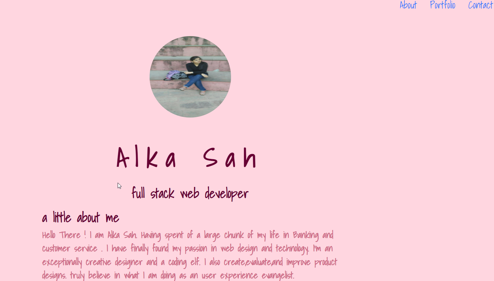

### Alka Sah React Portfolio

## Description

This project is a single-page application using React.js to dynamically render content to create a portfolio that includes "About me", "Contact me", "Resume", and "Portfolio" pages. Take a look at my work through my portfolio page and get to know me a little bit! Download my resume to view my work experience and where to find me.

## Table of contents

* Installation
* Usage
* Tests

## Installation

The user should clone the repository from GitHub and install dependencies. To run React, run npm start.

## Usage

This application will allow users view an about me page, send information through a contact form, view my projects, and view my resume.
Please view deployed application on https://alka485.github.io/react-porfolio/

Heroku Link  : https://peaceful-ridge-20529.herokuapp.com/#about

## Tests

There are no tests for this application.

